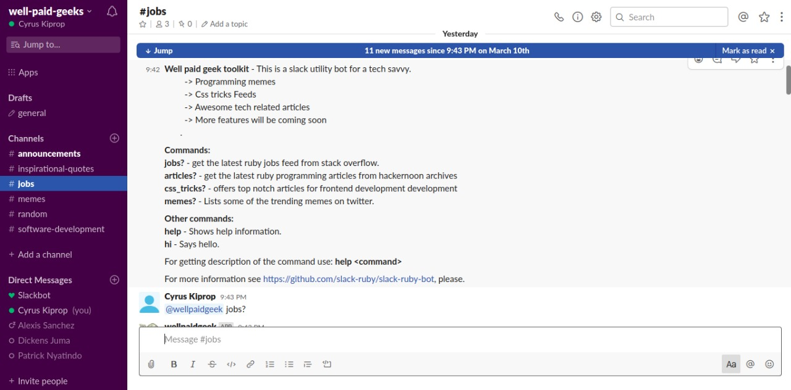

# WellPaidGeek slack BOT!!
<!-- TABLE OF CONTENTS -->
## Table of Contents

* [About the Project](#about-the-project)
* [Gems](#gems)
* [Pre-requisites](#Pre-requisites)
* [Pre-installation](#Pre-installation)
* [Using the bot](#Usage)
* [Configuring the bot](#configuring-the-bot)
* [Built With](#built-with)
* [License](#license)
* [Authors](#Authors)
* [Contributing](#Contributing)
* [License](#License)

<!-- ABOUT THE PROJECT -->
## About The Project

Slack Bot for the tech Savvy. The bot was built using ruby. The bot was designed to bring efficiency to programmers through various services. The bot offers four services as of now, mainly:- 

| Command     | Description  
| :---:       |  :---:                     |
| memes?      |  provide latest memes for programmers |
| css_tricks? |  Latest UI~UX articles|
| articles?   |  All the latest tech articles from Hackernoon|
| jobs?       |  Latest software development job feed from stack overflow|

## Gems
- puma
- ruby-slack-bot
- dotenv
 

## Pre-requisites
- Make sure you have [ruby](https://rubyinstaller.org) installed 
on your computer
- gem install bundler =>gem file to manage ruby gems
- A terminal bash for linux or cmd for windows
- Slack app or a latest browser (Google chrome recommended)
- Git 
- Experience with working with bash command or any other equivalent platform.

## Pre-installation
- create a new slack workspace [here](https://slack.com/create#email) that you would like to embed the bot.
- configure a new bot for your workspace.check [here](http://slack.com/services/new/bot) for more information.
- Name the bot wellpaidgeek and copy the API_KEY. click [here](https://slack.com/intl/en-ke/help/articles/115005265703-Create-a-bot-for-your-workspace) for more instruction on how to do that.
- The API_KEY will be important for the steps that follow.
- Create at least 3 channels on your newly created workspace. i.e (memes, jobs, articles and csstricks ) etc
-Continue with the following steps

 ## Configuring-the-Bot

 ## ->Step #1
- Make sure git is configured correctly.
- Clone the wellpaidgeek bot source code from [here](https://github.com/Cyrus-Kiprop/well-paid-geek-bot/tree/develop)
- Navigate into the cloned folder (wellpaidgeek)
- Run 'bundle install' to install all the necessary packages
- Create a .env file at the root folder->'mkdir .env'
- Create a SLACK_API_TOKEN variable and assign it the API_KEY derived from the pre-installation step.
- Open the terminal and execute 'rackup' (remember this should be done at the root of the project directory).
- Dont terminate the process started up 'rackup' command, because in doing so, the bot will be deactivated and it status changed to offline.

 ## ->Step #2 
- Sign in into your newly created workspace.
- There you should see your wellpaidgeek bot online. 
- Invite the wellpaidgeek bot to the channels you created earlier.

## Usage
- On any of the channels type '@wellpaidgeek help' to access the list of all the available commands supported by the bot. Be sure to replace @wellpaidgeek with the name of your bot, incase you used a different bot name.
- Prefix all the commands with '@wellpaidgeek' or your bot name. i.e '@wellpaidgeek memes?'.
- If you made this far !! CONGRATULATIONS
- Enjoy the BOT service!!!

## Built With
This BOT was built using Ruby. 

## Authors

👤 **Cyrus Kiprop**

- Github: [Cyrus-Kiprop](https://github.com/Cyrus-Kiprop)
- Twitter: [@kipropJS](https://twitter.com/kipropJS)
- Linkedin: [Cyrus Kiprop](https://www.linkedin.com/in/cyrus-kiprop-ba7320120/)

## 🤝 Contributing

Contributions, issues and feature requests are welcome!

Feel free to check the [issues page](https://github.com/Cyrus-Kiprop/well-paid-geek-bot/issues).

## Show your support

Give a ⭐️ if you like this BOT!

## 📝 License

This project is [MIT](LICENSE) licensed.